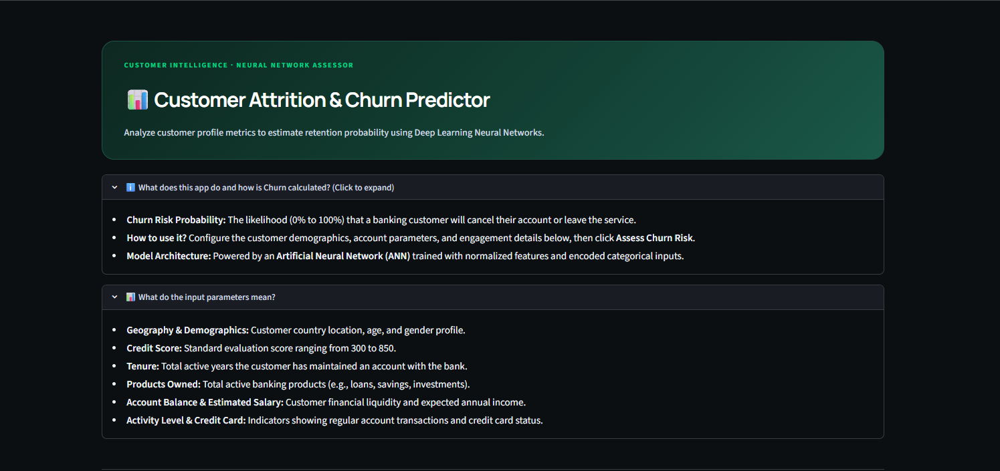
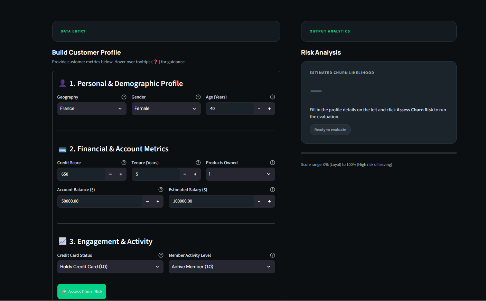

# Customer Churn Prediction with an Artificial Neural Network

An end-to-end machine learning project that estimates whether a bank customer is likely to leave (churn). It includes a Jupyter notebook for data preparation and model training, a saved TensorFlow/Keras model, saved preprocessing objects, and an interactive Streamlit application for making predictions from a customer profile.

> The prediction is a model estimate for decision support. It is not a guarantee that a customer will leave, and it does not explain the cause of a particular customer's risk.

## App preview

### Customer churn dashboard



### Customer profile and risk assessment



## What the app predicts

The app predicts the likelihood that a bank customer will exit their relationship with the bank. The model returns a value from 0 to 1, which the interface displays as a percentage:

- A result closer to **0%** means the model estimates lower churn likelihood.
- A result closer to **100%** means the model estimates higher churn likelihood.
- The interface groups the score into low, moderate, and high risk bands to make the result easier to interpret. These bands are presentation thresholds, not separately trained classes.

The prediction uses the customer attributes entered in the form:

| Input | Meaning |
| --- | --- |
| Credit score | Customer's credit score |
| Geography | Country/category used in the training data |
| Gender | Gender category encoded for the model |
| Age | Customer age |
| Tenure | Number of years with the bank |
| Balance | Account balance |
| Number of products | Number of bank products held |
| Has credit card | Whether the customer has a credit card |
| Is active member | Whether the customer is marked as active |
| Estimated salary | Estimated customer salary |

## Algorithm and model

This is a **supervised binary classification** project. The target column is `Exited` in `Churn_Modelling.csv` (1 indicates the customer exited; 0 indicates they did not).

The classifier is a **feed-forward Artificial Neural Network (ANN)** built with TensorFlow/Keras' `Sequential` API:

| Layer | Units | Activation | Role |
| --- | ---: | --- | --- |
| Dense hidden layer 1 | 64 | ReLU | Learns patterns from the input features |
| Dense hidden layer 2 | 32 | ReLU | Learns higher-level feature combinations |
| Dense output layer | 1 | Sigmoid | Produces a churn probability |

The notebook compiles the model with the **Adam optimizer** (learning rate `0.01`), **binary cross-entropy** loss, and accuracy as a training metric. Training is configured for up to 100 epochs with a held-out validation split and **early stopping** on validation loss (`patience=10`, restoring the best weights). TensorBoard is used to log training progress.

The notebook splits the data into 80% training and 20% test data with `random_state=42`. The code uses the test split as the Keras validation data during fitting. No separate final test evaluation report or benchmark score is included in the repository, so README does not claim a measured model accuracy.

## Data preparation

The training workflow in `experiments.ipynb`:

1. Reads `Churn_Modelling.csv` with pandas.
2. Drops the identifier/name columns `RowNumber`, `CustomerId`, and `Surname`.
3. Encodes `Gender` using scikit-learn's `LabelEncoder`.
4. One-hot encodes `Geography` with `OneHotEncoder`.
5. Separates the features from the `Exited` target.
6. Splits data into train and validation/test partitions.
7. Fits a `StandardScaler` on training features and applies it to the validation/test features.
8. Trains and saves the neural network and preprocessing objects.

The Streamlit app applies the same saved encoders and scaler to form input before passing it to the model. Keeping the training and inference transformations aligned is important for meaningful predictions.

## Tools and libraries

| Tool | Use in this project |
| --- | --- |
| Python | Application and machine learning code |
| pandas | Loading the CSV dataset and assembling feature rows |
| NumPy | Numerical arrays used with preprocessing/model operations |
| scikit-learn | Train/test split, label and one-hot encoding, and feature scaling |
| TensorFlow / Keras | Building, training, saving, and loading the ANN |
| Streamlit | Interactive browser-based prediction interface |
| Jupyter Notebook | Experimentation, training workflow, and example inference |
| TensorBoard | Recording training logs from the notebook |
| Matplotlib | Available for visual analysis in the notebook workflow |
| pickle | Saving and loading fitted encoders and scaler |

## Project files

```text
.
├── app.py                    # Streamlit customer churn prediction interface
├── streamlitApp.py           # Additional Streamlit app file, if used
├── Churn_Modelling.csv       # Customer churn dataset
├── experiments.ipynb         # Data preparation, ANN training, and model saving
├── prediction.ipynb          # Example of loading artifacts and making a prediction
├── model.h5                  # Saved trained Keras model
├── label_encoder_gender.pkl  # Fitted gender label encoder
├── onehot_encoder_geo.pkl    # Fitted geography one-hot encoder
├── scaler.pkl                # Fitted feature standard scaler
├── assets/
│   ├── image.png             # Dashboard introduction screenshot
│   └── image2.png            # Form and risk panel screenshot
├── requirements.txt          # Python dependencies
└── README.md
```

The trained model and pickle files are already included. You do not need to retrain the notebook to run the app. Pickle files should only be loaded from trusted sources.

## Run the Streamlit app

### 1. Set up Python

Use a Python version supported by the TensorFlow release installed in your environment. Then create and activate a virtual environment.

**Windows PowerShell**

```powershell
py -m venv .venv
.\.venv\Scripts\Activate.ps1
```

**macOS / Linux**

```bash
python3 -m venv .venv
source .venv/bin/activate
```

### 2. Install dependencies

```bash
python -m pip install --upgrade pip
python -m pip install -r requirements.txt
```

### 3. Start the app

```bash
python -m streamlit run app.py
```

Streamlit prints a local address, usually `http://localhost:8501`. Open it in a browser, complete the customer profile, and select **Assess Churn Risk**.

If port 8501 is already in use, choose another port:

```bash
python -m streamlit run app.py --server.port 8502
```

## Retrain the model

To reproduce the training workflow, install the dependencies, open `experiments.ipynb` in Jupyter, and run its cells in order. The notebook expects `Churn_Modelling.csv` in the working directory and writes `model.h5`, `label_encoder_gender.pkl`, `onehot_encoder_geo.pkl`, and `scaler.pkl` there. Keep those generated files together with `app.py` for inference.

## Requirements and notes

- `scikit-learn==1.8.0` is pinned in `requirements.txt` to match the version recorded by the supplied serialized preprocessing objects.
- The app expects the model and all three `.pkl` files beside `app.py`.
- The app runs inference locally; customer values entered in the form are passed to the loaded model by the app.
- The displayed probability and risk band reflect the trained model's output and thresholds. They should be evaluated against appropriate business data before being used for operational decisions.

## License

No license is specified in this repository. Add a license file if you intend to distribute or reuse the project publicly.
